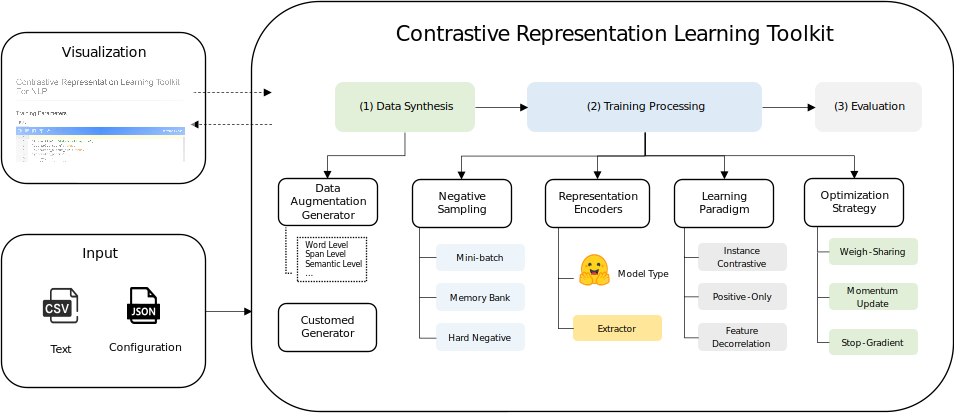

# CRLT: A Unified Contrastive Learning Toolkit for Unsupervised Text Representation Learning
This repository contains the code and relevant instructions of CRLT.

## Overview
The goal of CRLT is to provide an out-of-the-box toolkit for contrastive learning. Users only need to provide unlabeled data and edit a configuration file in the format of JSON, and then they can quickly train, use and evaluate representation learning models. CRLT consists of 6 critical modules, including data synthesis, negative sampling, representation encoders, learning paradigm, optimizing strategy and model evaluation. For each module, CRLT provides various popular implementations and therefore different kinds of CL architectures can be easily constructed using CRLT. 




## Installation

### Requirements

First, install PyTorch by following the instructions from [the official website](https://pytorch.org). Please use the correct `1.10` version corresponding to your platforms/CUDA versions. PyTorch version higher than `1.10` should also work. For example, if you use Linux and CUDA10.2, install PyTorch by the following command,

```bash
conda install pytorch==1.10.0 cudatoolkit=10.2 -c pytorch
```

Then run the following script to install the remaining dependencies,

```bash
conda env create -f requirements.yaml
```

The evaluation code for sentence embeddings is based on a modified version of [SentEval](https://github.com/facebookresearch/SentEval). It evaluates sentence embeddings on semantic textual similarity (STS) tasks and downstream transfer tasks. For STS tasks, our evaluation takes the "all" setting, and report Spearman's correlation. See [SimCSE](https://arxiv.org/pdf/2104.08821.pdf) for more details.

Before training, please download the relevent datasets by running:
```bash
cd utils/SentEval/data/downstream/
bash download.sh
```
Then, running the command to install the SentEval toolkit:
```bash
cd utils/SentEval
python setyp.py install
```

## Getting Started

### Data

For unsupervised training, we use sentences from English Wikipedia provided by [SimCSE](https://arxiv.org/pdf/2104.08821.pdf), and the relevant dataset should be download and moved to the `data/wiki` folder:

|Filename | Data Path | AliyunDrive |
|:--------|:----------|:-----------:|
| wiki1m_for_simcse.csv | data/wiki/ | [Download](https://www.aliyundrive.com/s/aZrMskbSYW7) |
| wiki.csv | data/wiki/ | [Download](https://www.aliyundrive.com/s/aZrMskbSYW7) |

data/STSB

### Training

#### GUI
We provide example training scripts for SimCSE (the unsupervised version) by running:
```bash
conda activate crlt
python app.py
```
After editing the training parameters, users click the `RUN` button and will get the evaluation result on the same page.

#### Terminal
Rather than training with the web GUI, users can also train by running:
```bash
python main.py examples/simcse.json
```
Using different types of devices or different versions of CUDA/other softwares may lead to slightly different performance:

| STS12 | STS13 | STS14 | STS15 | STS16 | STSBenchmark | SICKRelatedness |  Avg. |
|:------|:------|:------|:------|:------|:-------------|:----------------|:-----:|
| 71.61 | 81.99 | 75.13 | 81.39 | 78.78 |    77.93     |      69.17      | 76.57 |

## Bugs or questions?

If you have any questions related to the code or the usage, feel free to email `xiaoming2021@iscas.ac.cn`. If you encounter any problems when using the code, or want to report a bug, you can open an issue. Please try to specify the problem with details so we can help you better and quicker!


